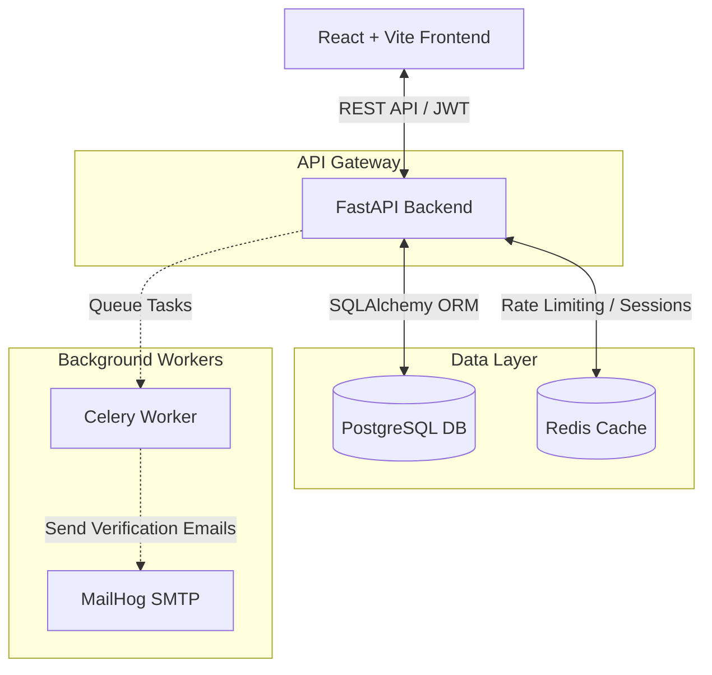
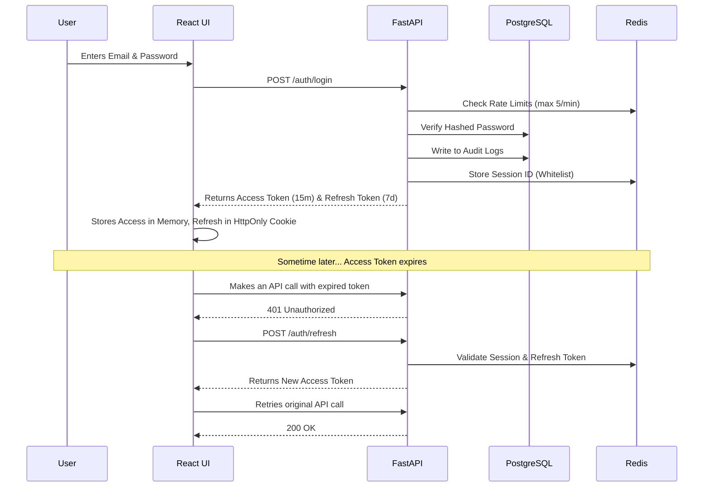
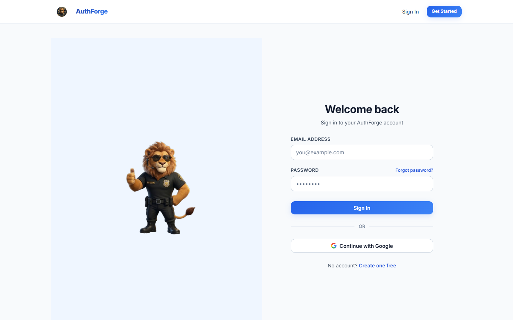
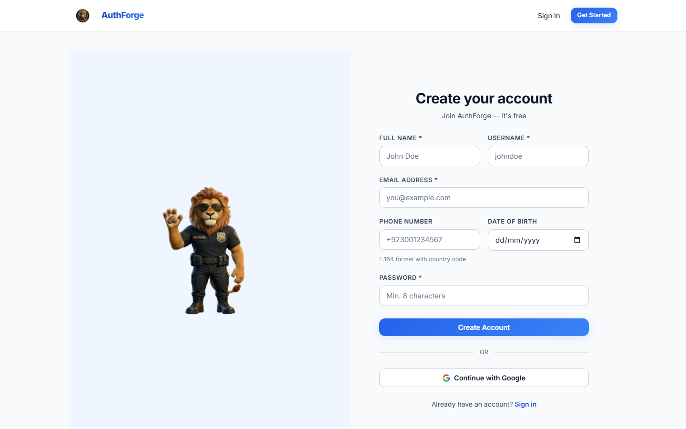
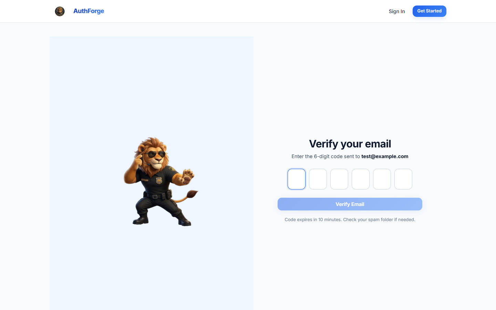

# AuthForge Identity Platform


AuthForge is a production-grade, highly secure authentication and identity management platform. It features a hardened backend built with **FastAPI** (Python) and a modern, minimalist split-screen frontend built with **React & Vite**.

## 🎯 The Problem
Building a secure, scalable authentication system from scratch is an immense hassle for developers. Implementing rate limiting, JWT rotation, background email verification, role-based access control, and OAuth is prone to security flaws and takes weeks of development time.

## 💡 The Solution (Identity-as-a-Service)
AuthForge solves this by providing a completely built, "drop-in" identity infrastructure. Whether you are building a new internal tool or launching a SaaS, AuthForge handles the heavy lifting of user identity, security, and session management right out of the box.

Key features include:
*   **Role-Based Access Control (RBAC):** Three-tier roles (`user`, `moderator`, `admin`).
*   **Google OAuth 2.0 Integration:** Seamless 3rd-party sign-ins.
*   **Brute-Force Protection & Rate Limiting:** Powered by Redis sliding-window algorithms.
*   **Background Tasks:** Celery-powered asynchronous email verification and password resets.
*   **Immutable Audit Logging:** Permanent tracking of sensitive user actions for security compliance.

---

## 🏗️ Architecture

The system follows a microservice-like architecture using robust, industry-standard technologies.



---

## 🔄 Authentication Flow

Below is the standard authentication and token rotation flow that protects your application:



---

## 📸 Screenshots

AuthForge features a highly professional, pristine light-mode aesthetic starring our "AuthForge Bodyguard" lion mascot:

| Login Page | Sign Up Page |
| :---: | :---: |
|  |  |

| Verify Email | Dashboard Header |
| :---: | :---: |
|  |  |

*(Note: The actual deployed platform features a seamless split-screen experience!)*

---

## 🚀 Boot-Up Guide (How to Run Locally)

To run the full stack locally, you need two terminal windows: one for the Dockerized backend and one for the React frontend.

### 1. Run the Backend (Docker)
Ensure you have Docker and Docker Compose installed. The backend runs entirely inside containers.

1.  **Clone the repository and navigate to the project root:**
    ```bash
    git clone https://github.com/yourusername/AUTHFORGE.git
    cd AUTHFORGE
    ```
2.  **Set up environment variables:**
    Copy the `.env.example` file to `.env` and configure any secrets:
    ```bash
    cp .env.example .env
    ```
3.  **Start the services:**
    This command will build and start FastAPI, PostgreSQL, Redis, Celery, and MailHog in the background.
    ```bash
    docker-compose up -d --build
    ```
4.  **Backend Services Available At:**
    *   **API Docs (Swagger UI):** http://localhost:8001/docs
    *   **MailHog (View sent emails/OTPs):** http://localhost:8025

### 2. Run the Frontend (React / Vite)
The frontend requires Node.js (v18+) and npm.

1.  **Navigate to the frontend directory:**
    ```bash
    cd frontend
    ```
2.  **Install dependencies:**
    ```bash
    npm install
    ```
3.  **Start the development server:**
    ```bash
    npm run dev
    ```
4.  **Access the web app:**
    *   Open your browser and go to: **http://localhost:5173** (or the port specified in your terminal).

---

## 🛑 Stopping the Application
To stop the backend database and API services, run:
```bash
docker-compose down
```
To stop the frontend, simply press `Ctrl + C` in the terminal where `npm run dev` is running.
